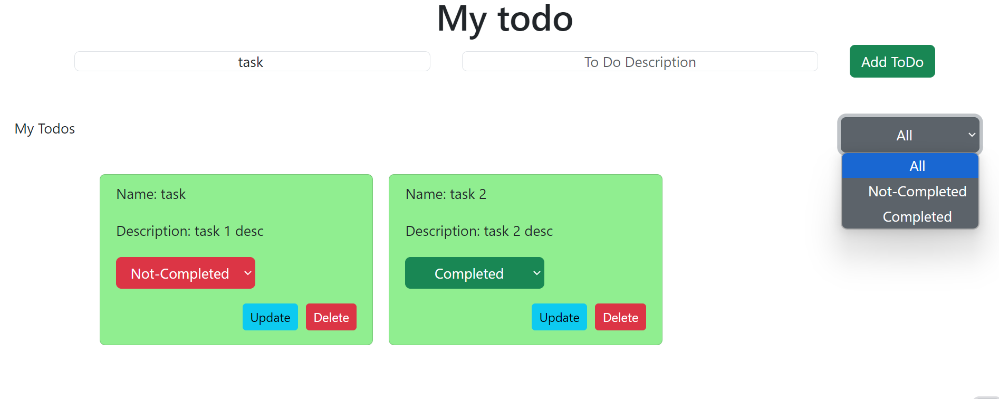
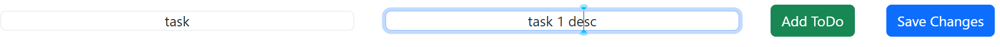

> # To Do Application

This is a ToDo List Application made using function based React - Vite.

&nbsp;

&nbsp;
This application mainly consist of two input fields as mentioned in above image. Being the task's name and description and upon clicking **Add ToDo** button the tasks are rendered and with status as Not-Completed as default.

The dropdown for the status shows the tasks with the selected status. All shows all the tasks and Completed and Not-completed shows the respective ones.

---

&nbsp;

## Task Card

The task component contains name , description and a drop down for the status. When Clicked on the dropdown, the completed option becomes green and red for not-completed(default value.) And clicking on delete button, deletes the task completely.

&nbsp;

&nbsp;

### Updating the task

Upon Clicking on the update button, you will be able to see the task details on the input fields and after making changes, you should just click on the new Save Changes button available to save.
